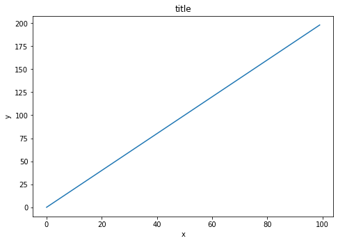
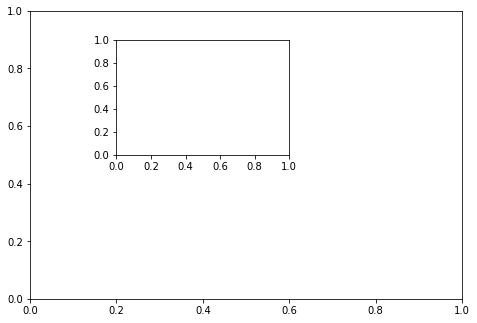
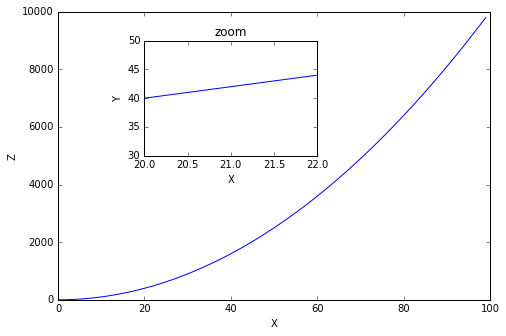
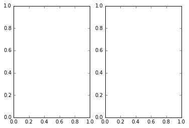
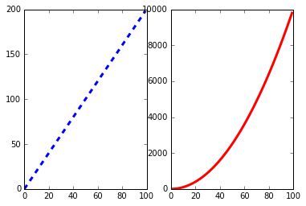

# Ejercicios Matplotlib

¡Bienvenido a los ejercicios para revisar matplotlib! Tómese su tiempo con estos, Matplotlib puede ser difícil de entender al principio. Estas son tramas relativamente simples, pero pueden ser difíciles si esta es su primera vez con matplotlib, no dude en consultar las soluciones a medida que avanza.

** * NOTA: TODOS LOS COMANDOS PARA GRAFICAR UNA FIGURA DEBEN IR EN LA MISMA CÉLULA. SEPARARLAS EN CÉLULAS MÚLTIPLES PUEDE CAUSAR QUE NADA SE MOSTRARÁ. * **

# Ejercicios

Siga las instrucciones para recrear los gráficos con estos datos:

## Datos


```python

```


** Importe matplotlib.pyplot como plt y establezca% matplotlib en línea si está utilizando el cuaderno jupyter. ¿Qué comando utilizas si no estás usando el cuaderno jupyter? **


```python

```

## Ejercicio 1

** Siga estos pasos: **
* ** Crea una figura llamada fig usando plt.figure () **
* ** Use add_axes para agregar un eje al lienzo de la figura en [0,0,1,1]. Llame a este nuevo eje "eje". **
* ** Trace (x, y) en esos ejes y configure las etiquetas y títulos para que coincidan con el siguiente diagrama: **


```python

```


    Text(0.5, 1.0, 'title')





## Ejercicio 2
** Crea un objeto figura y coloca dos ejes sobre él, ax1 y ax2. Ubicado en [0,0,1,1] y [0.2,0.5, .2, .2] respectivamente. **


```python

```


** Ahora dibuje (x, y) en ambos ejes. Y llame a su figura objeto para mostrarlo. **


```python

```


## Ejercicio 3

** Cree el siguiente diagrama agregando dos ejes a un objeto de figura en [0,0,1,1] y [0.2,0.5, .4, .4] **


```python

```





** Ahora use las matrices x, y, y z para recrear el diagrama a continuación. Observe los límites xlimits e y en el diagrama insertado: **


```python

```





## Ejercicio 4

** Use plt.subplots (nrows = 1, ncols = 2) para crear la gráfica a continuación. **


```python

```





* Ahora trace (x, y) y (x, z) en los ejes. Juega con el ancho de línea y el estilo **


```python

```





** Vea si puede cambiar el tamaño del gráfico agregando el argumento figsize () en plt.subplots () están copiando y pegando su código anterior. **


```python

```


    <matplotlib.text.Text at 0x115847da0>


# ¡Excelente trabajo!
   
 [**Ejercicios Resueltos**](Matplotlib%20Ejercicios%20-%20Solutions.md)    


