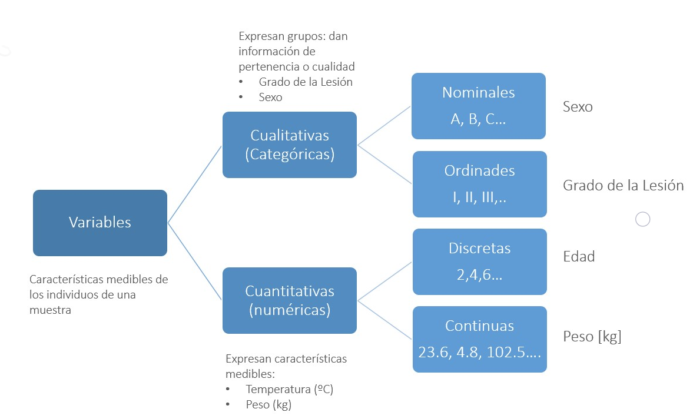

# Introducción

## ¿Que es el análisis de datos?

El Análisis de Datos (Data Analysis, o DA) es la ciencia que examina datos en bruto con el propósito de sacar conclusiones sobre la información. El análisis de datos es usado en varias industrias para permitir que las compañías y las organizaciones tomen mejores decisiones empresariales y también es usado en las ciencias para verificar o reprobar modelos o teorías existentes.

## ¿Cuáles son las etapas de un proceso de análisis de datos?

Es esencial que tengas una foto global de un proceso de análisis de datos. Te puedes perder en la cantidad de técnicas y estrategias estadísticas que tienes a tu disposición, a continuación puedes ver las 6 etapas.

1. **El Problema.** Todo nace de un problema, de una necesidad real. En esta etapa definirás el foco del estudio.
2. **La Recolección.** Es el diseño de un método para obtener mas DATOS, técnicamente es un proceso de experimentación. Puede ser una encuesta, pruebas en laboratorios, con pacientes, nutrirse de datos de marketing en redes sociales etc…
3. **La Limpieza.** Homogeneizar los datos en cuanto a formato, deshacer observaciones que no te interesan y almacenar las más útiles.
4. **La Exploración.** Utilizando la estadística descriptiva podrás traducir los DATOS a gráficos y características que puedas interpretar.
5. **El Análisis.** Con la ayuda de la estadística inferencia encontrarás conclusiones de un conjunto grande (población) con la información de una pequeña parte de este conjunto (muestra). El contraste de hipótesis es la herramienta más famosa de esta etapa. Pero existen otras técnicas como: la predicción, la clasificación o los métodos de causa-efecto. Entre otros.
6. **La Conclusión.** Interpretarás los resultados del análisis y listarás las conclusiones. Estarás mucho más cerca del objetivo que te habrás planteado al inicio.

## Usos del análisis de datos

El análisis de datos se utiliza en muchas industrias, independientemente del ramo, nos da las bases para tomar o no una decisión o cerciorarnos si una hipótesis es cierta o no.

* Mercadotecnia: el análisis de datos se ha usado principalmente para predecir el comportamiento de los consumidores, incluso para poder calificarlo. Conoce cómo hacer un análisis de datos para tu campaña de marketing.

* Recursos Humanos: el análisis de datos también es muy útil dentro de las empresas para mantener un buen clima laboral , y fuera de ella, calificando empleados potenciales.

* Académicos: Al igual que las empresas el análisis de datos también está presente en la educación, sirve para seleccionar a los alumnos de nuevo ingreso y para medir el rendimiento de los estudiantes.

## Técnicas de análisis de datos

Si queremos datos útiles, debemos analizarlos. Para ello debemos recurrir a diversas técnicas que dependen del tipo de información que se esté recopilando, por lo que es importante tener definida la técnica a utilizar antes de implementarla.

* Análisis de datos cualitativo: Los datos cualitativos se presentan de manera verbal (en ocasiones en gráficas). Se basa en la interpretación. Las formas más comunes de obtener esta información es a través de entrevistas abiertas, grupos de discusión y grupos de observación, donde los investigadores generalmente analizan patrones en las observaciones durante toda la fase de recolección de datos.

* Análisis de datos cuantitativos: Los datos cuantitativos se presentan en forma numérica. Se basa en resultados tangibles.

El análisis de datos se centra en llegar a una conclusión basada únicamente en lo que ya es conocido por el investigador. La forma en que recopila sus datos debe relacionarse con la forma en que está planeando analizarla y utilizarla, también hay que asegurarse de recopilar información precisa en la que puedas confiar, para ello existen muchas técnicas de recolección de datos.

## Ventajas del análisis de datos

* Capacidad para tomar decisiones de negocios más rápidas e informadas, respaldadas por hechos.

* Ayuda a las empresas a identificar problemas de rendimiento que requieren algún tipo de acción.

* Comprensión más profunda de los requisitos de los clientes, lo que, a su vez, crea mejores relaciones comerciales.

* Mayor conciencia del riesgo, permitiendo la implementación de medidas preventivas.

* Puede verse de forma visual, lo que permite tomar decisiones más rápidas y mejores.

* Puede proporcionar a una empresa una ventaja sobre sus competidores.

* Mejor conocimiento del desempeño financiero del negocio.

* Se ha demostrado que reduce los costos y, por lo tanto, aumenta los beneficios.

[**Siguiente Lección**](02%20Proyecto%20llamadas%20al%20911%20-%20Solucion.ipynb)

