# Visualización de Datos

## MATPLOTLIB

### Instalación: 

- conda install matplotlib
- pip install matplotlib


```python
import matplotlib.pyplot as plt
%matplotlib inline
import numpy as np
```

### Gráfico Básico:


```python
X = np.linspace(-np.pi, np.pi, 300, endpoint=True)
s,c = np.sin(X), np.cos(X)
plt.figure(figsize=(4,4))
plt.plot(X,s,color="red", linewidth=2, linestyle="--")
plt.plot(X,c,color="blue", linewidth=1, linestyle="-")
plt.show()
```


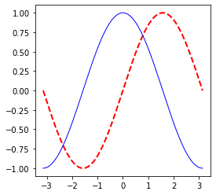


### Estableciendo límite:


```python
plt.xlim(X.min()*1.2, X.max()*1.2)
plt.ylim(c.min()*1.1, c.max()*1.1)
plt.plot(X,s,color="red", linewidth=2, linestyle="--")
plt.plot(X,c,color="blue", linewidth=1, linestyle="-")
plt.show()
```


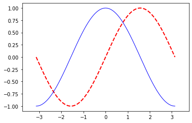


### Configurando las etiquetas:


```python
plt.xticks( [-np.pi, -np.pi/2, -np.pi/4, 0, np.pi/4, np.pi/2, np.pi])
plt.yticks([-1, -0.5, 0, 0.5, +1])
plt.plot(X,s,color="red", linewidth=2, linestyle="--")
plt.plot(X,c,color="blue", linewidth=1, linestyle="-")
plt.show()
```


### Configurando mascaras a las etiquetas:


```python
plt.xticks([-np.pi, -np.pi/2, -np.pi/4, 0, np.pi/4, np.pi/2, np.pi],
       [r'$-\pi$', r'$-\pi/2$', r'$-\pi/4$',r'$0$', r'$-\pi/4$',r'$+\pi/2$', r'$+\pi$'])
plt.plot(X,s,color="red", linewidth=2, linestyle="--")
plt.plot(X,c,color="blue", linewidth=1, linestyle="-")
plt.show()
```


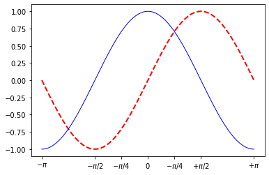


### Agregamos una leyenda:


```python
plt.plot(X, c, color="blue", linewidth=2, linestyle="--", label="Cosine")
plt.plot(X, s, color="red",  linewidth=1.5, linestyle="-", label="Sine")

plt.legend(loc='best',frameon=True)
```


    <matplotlib.legend.Legend at 0x1f21abb9128>


### Dibujando Áreas Acumulativas:


```python
plt.fill_between(X, 0, c, c > 0, color='blue', alpha=.25)
plt.fill_between(X, -1, s, s < 0, color='red',  alpha=.25)
```


    <matplotlib.collections.PolyCollection at 0x1f21afda400>


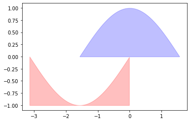


### SubPlots and Ejes:


```python
x1 = np.linspace(0,5,20)
y1 = x1** - x1
plt.subplot(1,2,1)
plt.plot(x1, y1, 'r--')
plt.subplot(1,2,2)
plt.plot(x1, y1, 'g*-')
```


    [<matplotlib.lines.Line2D at 0x1f21ca28630>]


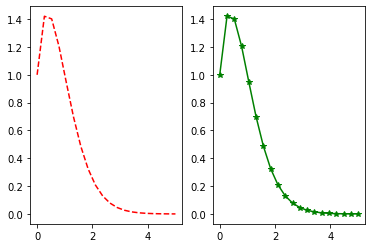


### Metodo Orientado a Objetos:


```python
x = np.linspace(-5,5,20)
fig, axes = plt.subplots(nrows=1, ncols=3,figsize=(10, 5))

axes[0].plot(x, x**2 - x, x, x**2)
axes[0].set_title("Polynomial Functions")

axes[1].plot(x, x**2 - 0.5, x, x**3-x**2-0.5)
axes[1].set_title("Polynomial Functions")

axes[2].plot(x, x*2+0.5, x, x**2)
axes[2].set_ylim([0, 30])
axes[2].set_xlim([0, 5])
axes[2].set_title("Polynomial Functions")
```


    Text(0.5, 1.0, 'Polynomial Functions')


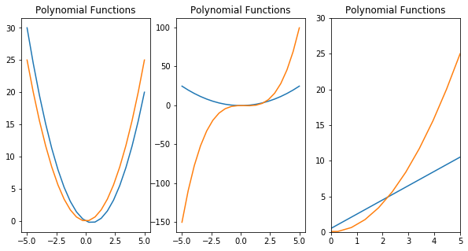


### Texto:


```python
axes[2].text(3, 5, r"$y=2x+0.5$", fontsize=15, color="blue")
axes[2].text(2.5, 10, r"$y=x^2$", fontsize=15, color="green")
fig
```


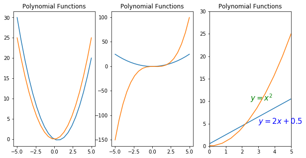


### Salvar el grafico:


```python
fig.savefig('../Python_Cursos/data/savefig.png',dpi=600)
```

### Insertar imagenes:

- Una imagen en color se puede representar como una matriz N x M x 3 correspondiente a N filas, M columnas y 3 canales o colores para el rojo, verde y azul en la representación RGB. También podría ser de 4 canales debido al canal de transparencia alfa con una notación N x M x 4.


```python
import matplotlib.image as mpimg
```


```python
img=mpimg.imread('../Python_Cursos/data/savefig.png')
img.shape
```


    (3000, 6000, 4)


```python
# imshow: Mostrando la imagen
plt.imshow(img)
plt.colorbar()
```


    <matplotlib.colorbar.Colorbar at 0x1f2493cf320>


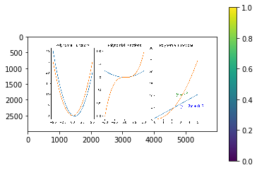


## Personalización de Gráficos


```python
# Importemos otras librerias de Matplotlib
import matplotlib.pyplot as plt
import matplotlib.ticker as mtick
import pandas as pd
%matplotlib inline
```

### Cargemos los datos
dataset: https://www.kaggle.com/shivachandel/kc-house-data


```python
data = pd.read_csv('../Python_Cursos/data/kc_house_data.csv')
df = data.sample(100)
df.head()
```


<div>
<style scoped>
    .dataframe tbody tr th:only-of-type {
        vertical-align: middle;
    }

    .dataframe tbody tr th {
        vertical-align: top;
    }

    .dataframe thead th {
        text-align: right;
    }
</style>
<table border="1" class="dataframe">
  <thead>
    <tr style="text-align: right;">
      <th></th>
      <th>id</th>
      <th>date</th>
      <th>price</th>
      <th>bedrooms</th>
      <th>bathrooms</th>
      <th>sqft_living</th>
      <th>sqft_lot</th>
      <th>floors</th>
      <th>waterfront</th>
      <th>view</th>
      <th>...</th>
      <th>grade</th>
      <th>sqft_above</th>
      <th>sqft_basement</th>
      <th>yr_built</th>
      <th>yr_renovated</th>
      <th>zipcode</th>
      <th>lat</th>
      <th>long</th>
      <th>sqft_living15</th>
      <th>sqft_lot15</th>
    </tr>
  </thead>
  <tbody>
    <tr>
      <th>1702</th>
      <td>8651402920</td>
      <td>20140505T000000</td>
      <td>219900.0</td>
      <td>4</td>
      <td>1.50</td>
      <td>1120</td>
      <td>5427</td>
      <td>1.0</td>
      <td>0</td>
      <td>0</td>
      <td>...</td>
      <td>6</td>
      <td>1120.0</td>
      <td>0</td>
      <td>1969</td>
      <td>2014</td>
      <td>98042</td>
      <td>47.3628</td>
      <td>-122.087</td>
      <td>1150</td>
      <td>5304</td>
    </tr>
    <tr>
      <th>21427</th>
      <td>1085623630</td>
      <td>20141003T000000</td>
      <td>436952.0</td>
      <td>4</td>
      <td>2.50</td>
      <td>2708</td>
      <td>4772</td>
      <td>2.0</td>
      <td>0</td>
      <td>0</td>
      <td>...</td>
      <td>9</td>
      <td>2708.0</td>
      <td>0</td>
      <td>2014</td>
      <td>0</td>
      <td>98092</td>
      <td>47.3413</td>
      <td>-122.178</td>
      <td>2502</td>
      <td>4900</td>
    </tr>
    <tr>
      <th>3213</th>
      <td>2028700265</td>
      <td>20150115T000000</td>
      <td>505000.0</td>
      <td>2</td>
      <td>1.75</td>
      <td>1310</td>
      <td>3816</td>
      <td>1.0</td>
      <td>0</td>
      <td>0</td>
      <td>...</td>
      <td>7</td>
      <td>1110.0</td>
      <td>200</td>
      <td>1929</td>
      <td>0</td>
      <td>98117</td>
      <td>47.6790</td>
      <td>-122.368</td>
      <td>1510</td>
      <td>3816</td>
    </tr>
    <tr>
      <th>13242</th>
      <td>1392800035</td>
      <td>20140618T000000</td>
      <td>559000.0</td>
      <td>2</td>
      <td>1.00</td>
      <td>1240</td>
      <td>6400</td>
      <td>1.0</td>
      <td>0</td>
      <td>1</td>
      <td>...</td>
      <td>7</td>
      <td>1060.0</td>
      <td>180</td>
      <td>1938</td>
      <td>0</td>
      <td>98126</td>
      <td>47.5493</td>
      <td>-122.377</td>
      <td>1240</td>
      <td>6400</td>
    </tr>
    <tr>
      <th>11606</th>
      <td>4139910030</td>
      <td>20150302T000000</td>
      <td>1300000.0</td>
      <td>5</td>
      <td>2.50</td>
      <td>4170</td>
      <td>33310</td>
      <td>2.0</td>
      <td>0</td>
      <td>0</td>
      <td>...</td>
      <td>11</td>
      <td>4170.0</td>
      <td>0</td>
      <td>1991</td>
      <td>0</td>
      <td>98006</td>
      <td>47.5455</td>
      <td>-122.126</td>
      <td>4670</td>
      <td>37960</td>
    </tr>
  </tbody>
</table>
<p>5 rows × 21 columns</p>
</div>


```python
x = df['sqft_living']
y = df['price']
```

### Visualizando los datos con Matplotlib predeterminado


```python
fig, ax = plt.subplots(figsize=(10,6))
ax.scatter(x, y, color='green')
```


    <matplotlib.collections.PathCollection at 0x1f25b386f98>


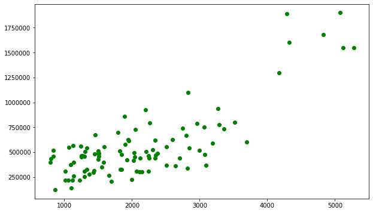


### Mejorando la visualización:


```python
# Removiendo bordes
ax.spines['top'].set_visible(False)
ax.spines['right'].set_visible(False)
fig
```


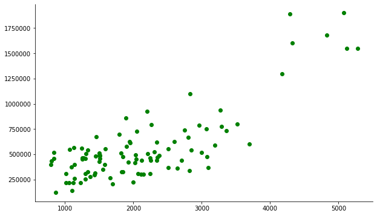


```python
# Usando Latex : www.latex-project.org
ax.set_title(r'House Size in $ft2$ vs. Price', fontsize=20, pad=20)
ax.set_xlabel('House Size', fontsize=16, labelpad=20)
ax.set_ylabel('Price', fontsize=16, labelpad=20)
fig
```


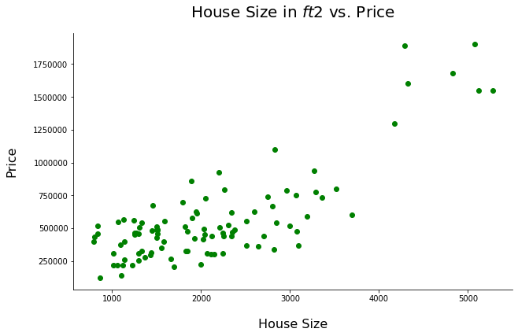


```python
# Adicionando etiquetas a los ejes
y_format = '${x:,.2f}'
y_tick = mtick.StrMethodFormatter(y_format)
ax.yaxis.set_major_formatter(y_tick)

x_format = r'{x:,.0f} $ft^2$'
x_tick = mtick.StrMethodFormatter(x_format)
ax.xaxis.set_major_formatter(x_tick)
fig
```


```python
# Cambiando el color, marker, size and transparency
ax.scatter(x, y, s=200, marker='+', color='#FF5733', alpha=0.8)
fig
```


```python
# Adicionamos lineas al grid
ax.grid(color='grey', linestyle='-', linewidth=0.25, alpha=0.5)
fig
```


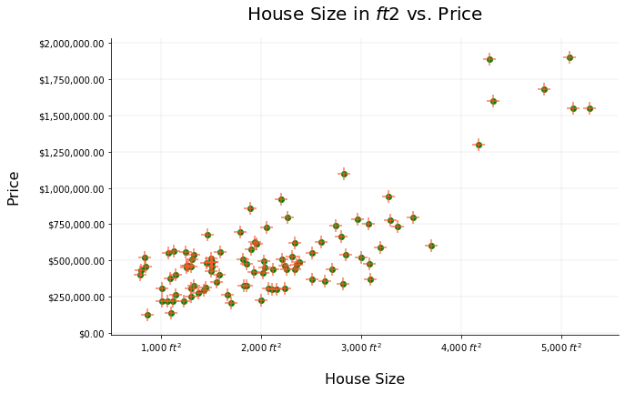


```python
# aplicando mapas de colores
ax.scatter(x, y, s=300, c=y, marker='+', cmap='Greens', alpha=0.8)
fig
```


```python
ax.scatter(x, y, s=300, c=y, marker='+', cmap='Reds', alpha=0.8)
ax.scatter(x, y, color='black')
fig
```


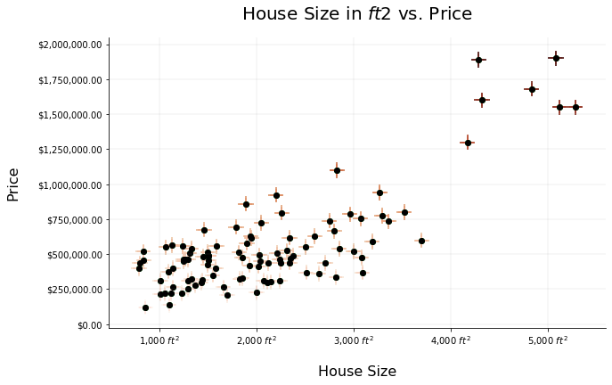


```python
np.corrcoef(x, y)
```


    array([[1.       , 0.7922816],
           [0.7922816, 1.       ]])


```python
# Añadir leyenda: coeficiente de correlación
corr_ = np.round(np.corrcoef(x, y)[0][1], 2)
corr_
```


    0.79


```python
ax.scatter(x, y, s=300, marker='o', color='black', alpha=0.5, label=f'Correlation: {corr_}')
ax.legend(fancybox=True, prop={'size': 14}, loc='best')
ax.scatter(x, y, color='w')
fig
```


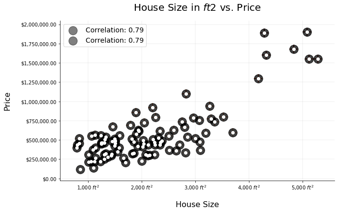


## Gráficos y Estadísticos

### Dispersión


```python
x = np.linspace(-5,5,20)
y = x**2
plt.scatter(x,y, s=200, color='yellow',marker='.',edgecolors='black')
```


    <matplotlib.collections.PathCollection at 0x1f25ba7af60>


### Barras


```python
classes = ['C1', 'C2', 'C3', 'C4']
colors  = ['#FF5733', '#3533FF', '#33FF5D', '#FDFF33']
numerical = [[10, 15, 5, 7],
             [1, 3, 4, 9],
             [4, 15, 8, 10],
             [7, 6, 13, 8]]

number_groups = len(classes) 
bin_width = 0.2

fig, ax = plt.subplots(figsize=(8,6))

for i in range(number_groups):
    ax.bar(x=np.arange(len(classes)) + i*bin_width, 
           height=numerical[i],
           width=bin_width,
           color=colors[i],
           align='center')

ax.set_xticks(np.arange(len(classes)) + 0.4)
ax.set_xticklabels(classes)
ax.legend(classes, facecolor='w', loc='best')
```


    <matplotlib.legend.Legend at 0x1f25cb6d908>


### Histogramas


```python
x = np.random.sample(50)
n, bins, patches = plt.hist(x, bins=20, facecolor='orange', alpha=0.7, density=True)
plt.setp(patches[3], 'facecolor', 'b')
plt.xlabel('bins')
plt.ylabel('Values')
plt.grid(color='grey', linestyle='-', linewidth=0.25, alpha=0.5)
```


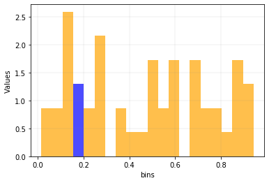


### Pastel


```python
# Pie chart, where the slices are ordered and plotted counter-clockwise:
labels = 'Segment 1', 'Segment 2', 'Segment 3', 'Segment 4'
sizes = [30, 35, 25, 10]  # percentages, the sum of all of them must to be 100%
explode = (0, 0.1, 0, 0)  # only "explode" the 2nd slice (i.e. 'Segment 2')

fig, ax = plt.subplots()
ax.pie(sizes, explode=explode, labels=labels, autopct='%1.1f%%', shadow=True, startangle=90)
ax.axis('equal')  # Equal aspect ratio ensures that pie is drawn as a circle.
```


    (-1.1144509022638318,
     1.1312382101451997,
     -1.2210697990242716,
     1.1057652336712287)


### Cajas

* Q3: Este es el valor del percentil 75 (bisagra superior) de los datos.
* Q3: Este es el valor del percentil 25 (bisagra inferior) de los datos.
* Caja: es una diferencia entre la bisagra superior y la bisagra inferior.
* Mediana: este es el punto medio de los datos.
* Max: esta es la valla interior superior. Es 1,5 veces el paso anterior a Q3.
* Min: esta es la valla interior inferior. Es 1,5 veces el paso por debajo de Q1.
* Cualquier valor que sea mayor que Max o menor que Min se llama un valor atípico.
* aproximadamente el 95% o se espera que los datos se encuentren entre las cercas internas


```python
_high = np.random.rand(20) + 0.5
center = np.random.rand(20)
_low = np.random.rand(20) - 0.5

data = [_high,center,_low]
plt.boxplot(data,notch=True, vert=True, patch_artist=True)
```


    {'whiskers': [<matplotlib.lines.Line2D at 0x1f25b6aa208>,
      <matplotlib.lines.Line2D at 0x1f25b6aa630>,
      <matplotlib.lines.Line2D at 0x1f25b6b2940>,
      <matplotlib.lines.Line2D at 0x1f25b6b2cf8>,
      <matplotlib.lines.Line2D at 0x1f25b6c1f98>,
      <matplotlib.lines.Line2D at 0x1f25b6c1d68>],
     'caps': [<matplotlib.lines.Line2D at 0x1f25b6aa9e8>,
      <matplotlib.lines.Line2D at 0x1f25b6aad30>,
      <matplotlib.lines.Line2D at 0x1f25b6b2dd8>,
      <matplotlib.lines.Line2D at 0x1f25b6c13c8>,
      <matplotlib.lines.Line2D at 0x1f25b6cb6d8>,
      <matplotlib.lines.Line2D at 0x1f25b6cba20>],
     'boxes': [<matplotlib.patches.PathPatch at 0x1f25b69af98>,
      <matplotlib.patches.PathPatch at 0x1f25b6b2390>,
      <matplotlib.patches.PathPatch at 0x1f25b6c19e8>],
     'medians': [<matplotlib.lines.Line2D at 0x1f25b6aae10>,
      <matplotlib.lines.Line2D at 0x1f25b6c1710>,
      <matplotlib.lines.Line2D at 0x1f25b6cbd68>],
     'fliers': [<matplotlib.lines.Line2D at 0x1f25b6b2400>,
      <matplotlib.lines.Line2D at 0x1f25b6c1a58>,
      <matplotlib.lines.Line2D at 0x1f25b6cbe48>],
     'means': []}


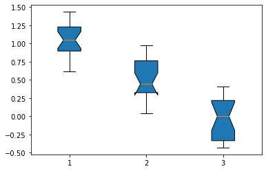


### Violin


```python
plt.figure(figsize=(9,4))
plt.violinplot(data,widths=0.40, vert=True, showmeans=True, showextrema=True, showmedians=True)
```


    {'bodies': [<matplotlib.collections.PolyCollection at 0x1f25b72acf8>,
      <matplotlib.collections.PolyCollection at 0x1f25b72af60>,
      <matplotlib.collections.PolyCollection at 0x1f25b73b2b0>],
     'cmeans': <matplotlib.collections.LineCollection at 0x1f25b72ab00>,
     'cmaxes': <matplotlib.collections.LineCollection at 0x1f25b73b4e0>,
     'cmins': <matplotlib.collections.LineCollection at 0x1f25b73b080>,
     'cbars': <matplotlib.collections.LineCollection at 0x1f25b73b748>,
     'cmedians': <matplotlib.collections.LineCollection at 0x1f25b73ba20>}


```python
fig, axes = plt.subplots(figsize=(9, 4))
axes.violinplot(data, widths=0.40, vert=True, showmeans=True, showextrema=True, showmedians=True)
axes.set_title('Violinplot', fontsize=10)
plt.setp(axes, xticks=[i+1 for i in range(len(data))], xticklabels=['high','center','low'])
```


    [<matplotlib.axis.XTick at 0x1f25ba5c2e8>,
     <matplotlib.axis.XTick at 0x1f25b75ac88>,
     <matplotlib.axis.XTick at 0x1f25b75a7b8>,
     Text(0, 0, 'high'),
     Text(0, 0, 'center'),
     Text(0, 0, 'low')]


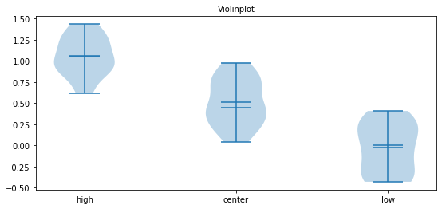


### Burbujas


```python
plt.style.use('ggplot')
df = pd.DataFrame(np.random.rand(50, 3), columns=['x','y','z'])
df.plot(kind='scatter',x='x',y='y',s=df['z']*400, color='red', edgecolors='black')
# s es el tamaño de las burbujas
```


    <matplotlib.axes._subplots.AxesSubplot at 0x1f25b795470>


### 3D


```python
from mpl_toolkits.mplot3d.axes3d import Axes3D
img = plt.figure()
ax = Axes3D(img)
x = np.arange(-5,5,0.25)
y = np.arange(-5,5,0.25)
X, Y = np.meshgrid(x, y)
V = np.sqrt(X**2 + Y**2)
Z = np.sin(V)
ax.plot_surface(X,Y,Z, rstride=2, cstride=2, cmap='hot',linewidth=0)
```


    <mpl_toolkits.mplot3d.art3d.Poly3DCollection at 0x1f25b4ba358>


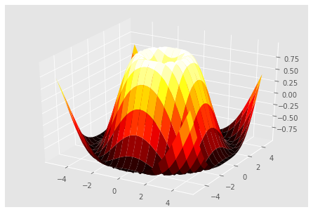


#### Barra de colores


```python
p = ax.plot_surface(X,Y,Z, rstride=1, cstride=1, cmap='hot',linewidth=0)
img.colorbar(p, shrink=0.5)
img
# Los parámetros rstride y cstride ayudan a dimensionar la celda en la superficie.
```


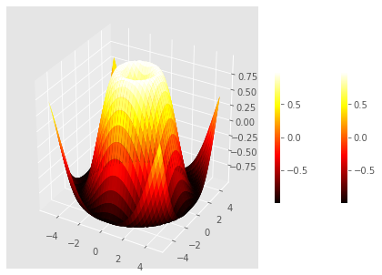


#### Establecer el ángulo de visión


```python
fig = plt.figure()
ax = Axes3D(fig)
ax.view_init(elev=0., azim=0)
ax.plot_surface(X, Y, Z, rstride=1, cstride=1, cmap='hot')
```


    <mpl_toolkits.mplot3d.art3d.Poly3DCollection at 0x1f22777ad30>


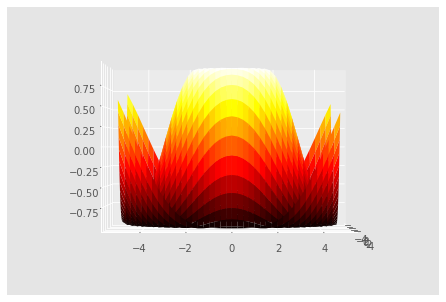


```python
# Configuración de la vista a 50 grados de elevación y ángulo de 30 grados:
fig = plt.figure()
ax = Axes3D(fig)
ax.view_init(elev=50., azim=30)
ax.plot_surface(X, Y, Z, rstride=1, cstride=1, cmap='hot')
```


    <mpl_toolkits.mplot3d.art3d.Poly3DCollection at 0x1f227a49a90>


### Línea 3D


```python
fig = plt.figure(figsize=(8,6))
ax = fig.gca(projection='3d')

v = np.linspace(-5 * np.pi, 5 * np.pi, 100)
z = np.linspace(-3, 3, 100)
r = z**2 + 1
x = r * np.sin(v)
y = r * np.cos(v)
 
ax.plot(x, y, z, label='3D curve')
ax.legend(loc='best')
```


    <matplotlib.legend.Legend at 0x1f227c5aac8>


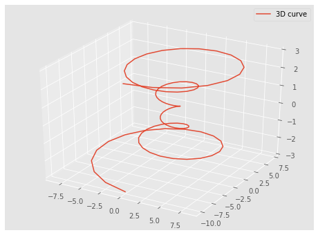


#<div style="text-align: right">    
 [**Ejercicios**](Ejercicios/Matplotlib/Matplotlib%20Ejercicios.ipynb)    
<div/>#


### References:
- http://www.matplotlib.org
- https://matplotlib.org/users/screenshots.html#simple-plot
- https://matplotlib.org/users/recipes.html#sharing-axis-limits-and-views
- www.latex-project.org
- https://htmlcolorcodes.com/
- https://matplotlib.org/2.0.1/examples/statistics/index.html
